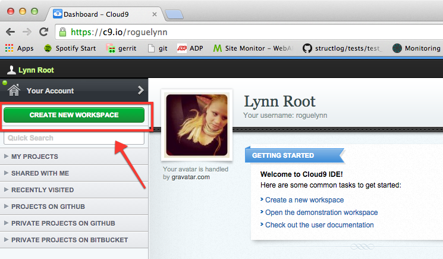
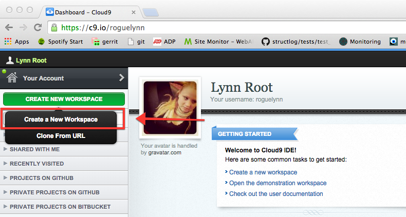
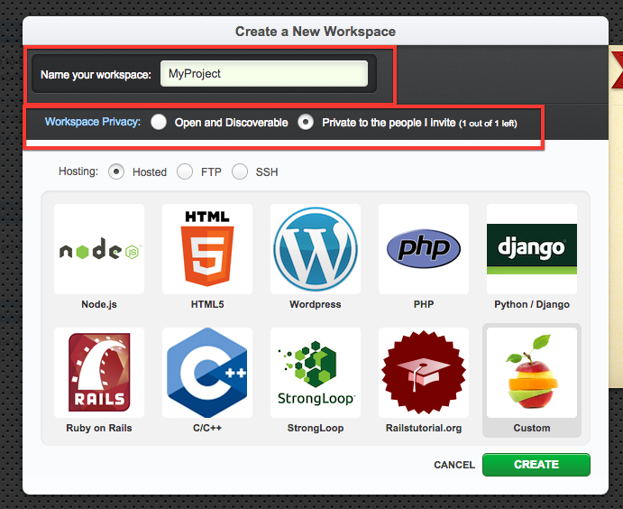
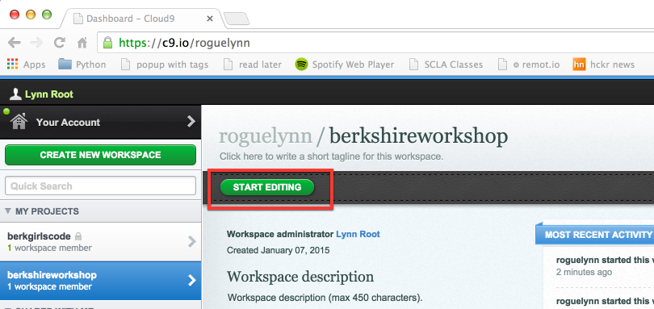
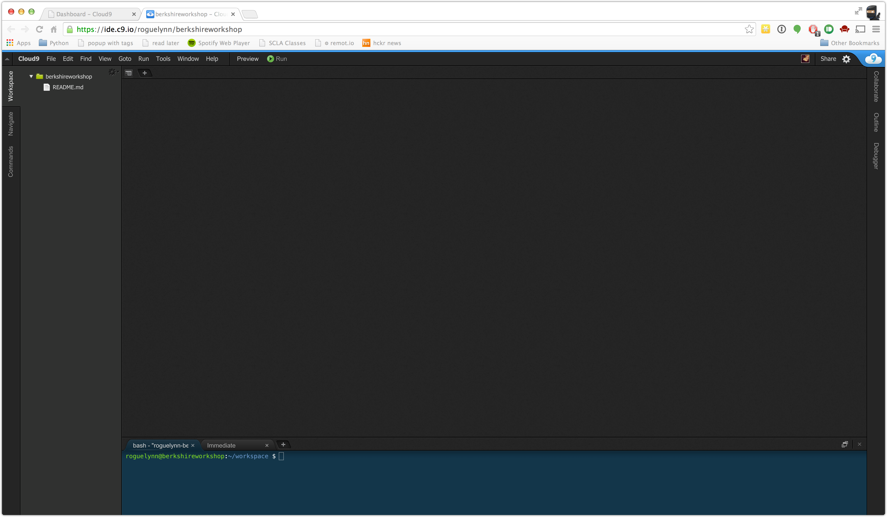
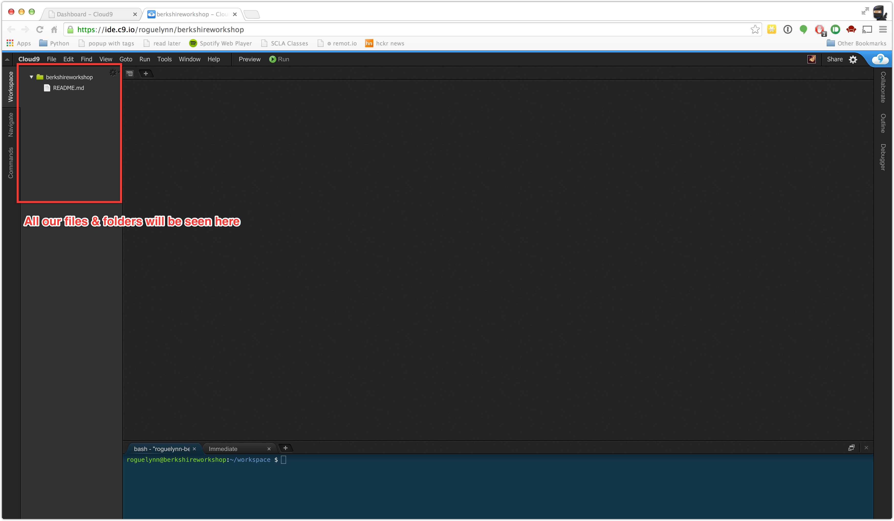
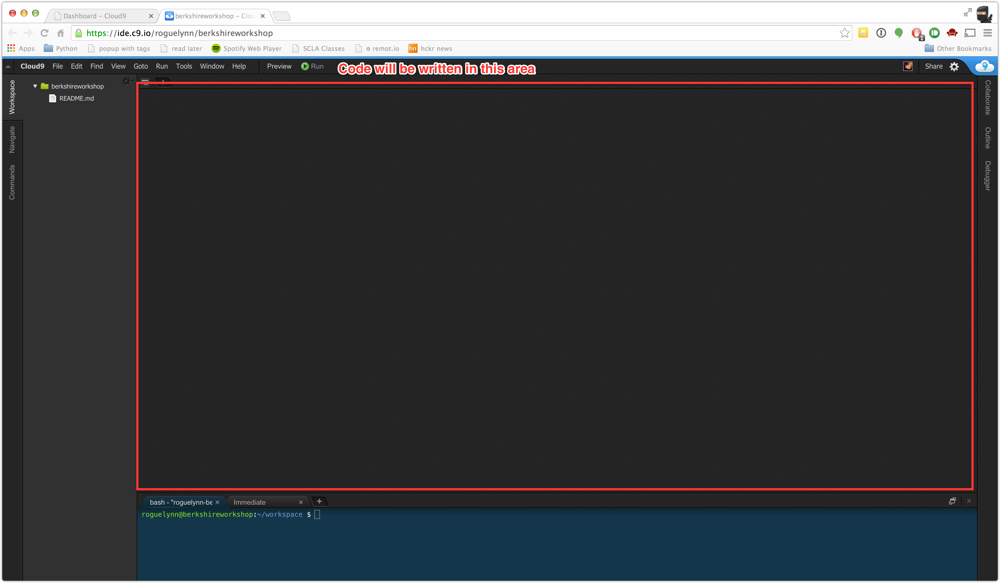
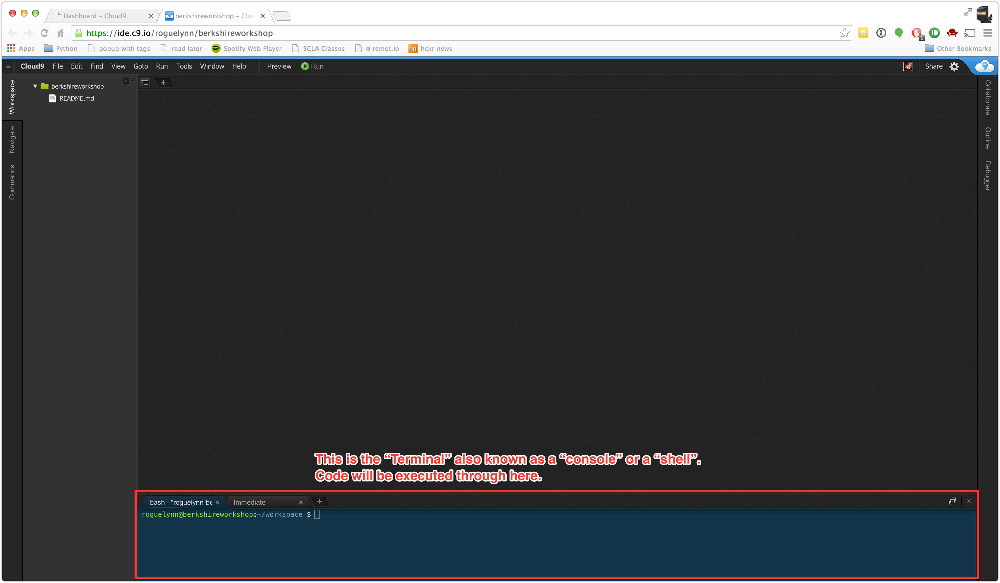

# Berkshire Girls Code workshop

## c9.io setup

1. create an account at [c9.io](https://c9.io/web/sign-up/free) and log in.
2. Click on "Create New Workspace" in the upper-right corner:
	  
3. Click on "Create a New Workspace":
	  
4. Create an awesome name for your project space, and then select whether you want your project to be "Open and Discoverable" or "Private to the people I invite".  You can change this later.  I selected "Private" because sometimes I'm embarrassed about my code, or am working on a super top secret project.  Leave the rest of the selections as is right now.  Then press "Create".
	  
5. It will be "processing" for a few seconds.  If it still says "processing" after 30 second, just refresh the page.
6. Click on your workshop name, then click "Start Editing".  A new browser tab should open.
      
7. This is what your workspace looks like when you open it up:
      
8. The side panel is where we will see all the files and folkders that we will create during the workshop
      
9. The main area is where we will write our code:
      
10. We will execute our code in the Terminal, which is in the lower portion of the window:
      

Just know how to get back to this for the workshop!
